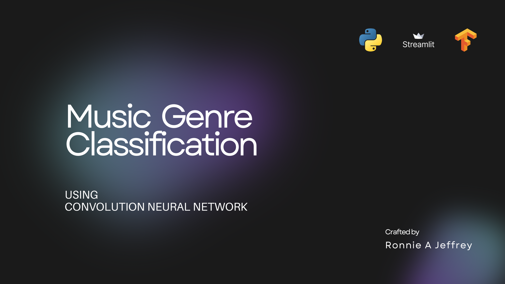

# Music Genre Classification



## Overview

This project focuses on classifying music tracks into various genres using machine learning techniques. By analyzing audio features, the model predicts the genre of a given music track, aiding in music organization and recommendation systems.

## Features

- Accurately classifies music tracks into predefined genres.
- Utilizes a trained neural network model (`Trained_Model.h5`).
- Includes scripts for training (`genre_classifier.ipynb`) and testing (`test_genre.ipynb`).

## Installation

1.  **Clone the repository:**

	   ```bash 
	   git clone https://github.com/ronnie-allen/Music_Genre_Model.git
	   cd Music_Genre_Model
	   ```
 

2.  **Set up a virtual environment:**
    
    ```bash
    python -m venv venv
    source venv/bin/activate   # On Windows: venv\Scripts\activate
    
    ```
    
3.  **Install the required dependencies:**
    
    ```bash
    pip install -r requirements.txt
    
    ```
    
    _Note:_ Ensure that the `requirements.txt` file lists all necessary packages.
    

## Usage

1.  **Training the Model:**
    
    -   Use the `genre_classifier.ipynb` notebook to train the model on your dataset.
    -   Ensure the dataset is placed in the `Music_Genre_Dataset` directory.
2.  **Testing the Model:**
    
    -   Use the `test_genre.ipynb` notebook to test the model's performance on new data.
    -   Place your test audio files in the `Music_Testing` directory.
3.  **Predicting Genre for a New Track:**
    
    -   Run the `Music_genre.py` script with the path to your audio file:
        
        ```bash
        python Music_genre.py --file_path path_to_your_audio_file
        
        ```
        

## Dataset

The project uses a dataset of music tracks categorized by genre. Ensure that your dataset is organized appropriately within the `Music_Genre_Dataset` directory for training purposes.

## Model

The trained model is saved as `Trained_Model.h5`. You can load this model for predictions or retrain it using the provided training scripts.

## Contributing

Contributions are welcome! Please follow these steps:

1.  Fork the repository.
2.  Create a new branch for your feature or bug fix.
3.  Submit a pull request with detailed changes.

## License

This project is licensed under the MIT License. See the [LICENSE](https://chatgpt.com/c/LICENSE) file for details.

## Acknowledgments

-   [Librosa](https://librosa.org/) for audio processing.
-   [Keras](https://keras.io/) for building the neural network.
-   [GTZAN Music Genre Dataset](http://marsyas.info/downloads/datasets.html) for providing the dataset.

## Contact

For any issues or feedback, feel free to open an issue on this repository or contact me directly.

----------

Happy coding! 🎶
